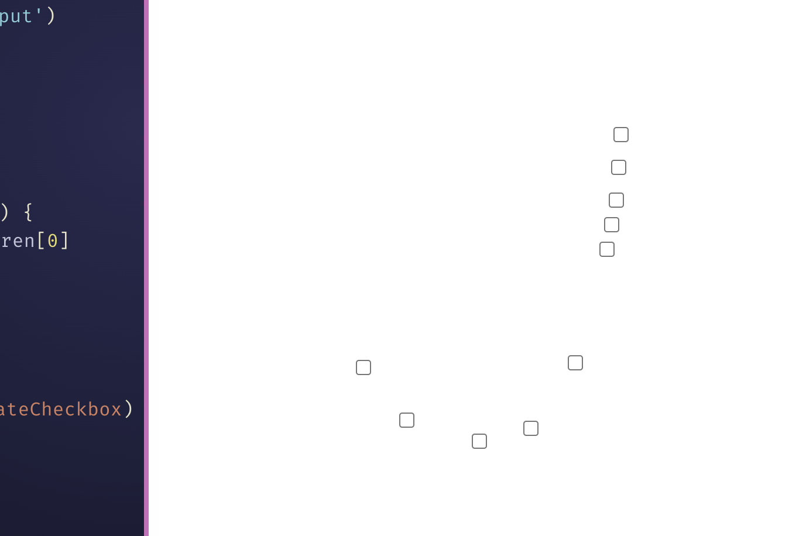

# mouse-checkbox-trail

This was an in class project, where we coded how to make a trailing line behind the mouse useing check boxes. This was written entirely through Javascript, excluding any CSS. It uses the "document.body.appendChild()" function to create a set of objects as well as a ' if' function, " if (document.body.children.length > 10) {
    const firstBox = document.body.children[0]
    firstBox.remove()" to cause only the first ten boxes to appear and any after that ammount to dissapear.
